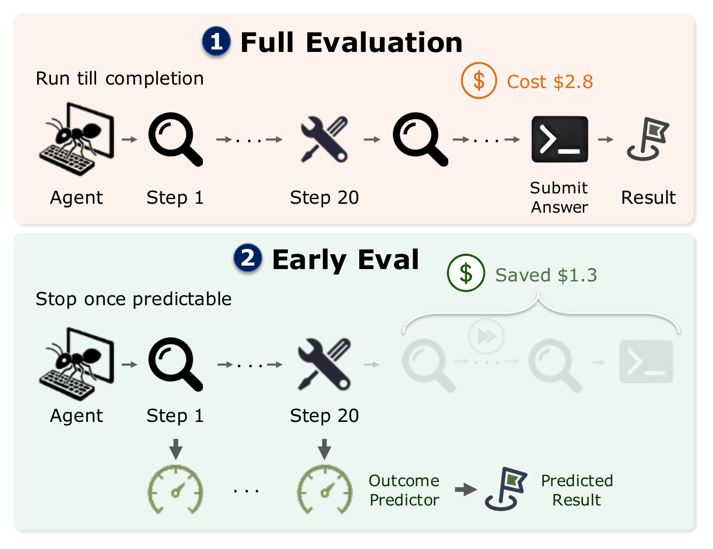
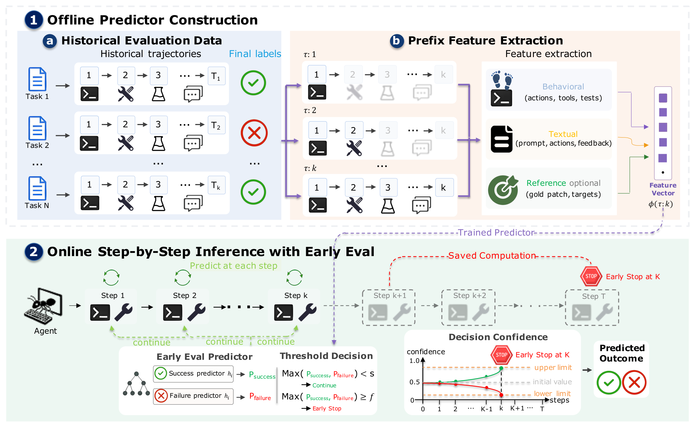

<div align="center">

<h1>EarlyEval</h1>

<h3>Cheaper Agent Evaluation via Early Outcome Prediction</h3>

<p>
<em>Stop an agent the moment its benchmark outcome becomes predictable —<br/>
cut 13–26% of execution steps and up to 44% of input tokens, and still get the same leaderboard.</em>
</p>

[](https://arxiv.org/abs/2609.02783)
[](https://www.python.org/)
[](https://github.com/microsoft/LightGBM)
[](LICENSE)
[](#-benchmarks-and-data)
[](#-benchmarks-and-data)
[](https://github.com/inphotoo/earlyeval/stargazers)

<p>
<a href="https://arxiv.org/abs/2609.02783"><b>Paper</b></a> ·
<a href="#-quick-start"><b>Quick Start</b></a> ·
<a href="#-results"><b>Results</b></a> ·
<a href="#-how-it-works"><b>How It Works</b></a> ·
<a href="#-reproducing-the-paper"><b>Reproduction</b></a> ·
<a href="#-citation"><b>Citation</b></a>
</p>



</div>

---

## 📖 Overview

Evaluating LLM agents has become **prohibitively expensive**. A single pass of a frontier model over
an agentic benchmark costs hundreds to thousands of dollars, and that price is paid again on every
iteration of prompt, scaffold, and model tuning.

Prior work attacks this with **benchmark distillation** — keeping fewer tasks. EarlyEval opens a
**complementary axis**: cutting cost *within* each task.

> **Key insight.** An agent's final outcome is often evident from its intermediate behavior long
> before the run finishes. An agent that applies the correct one-line fix at step 23 has already
> resolved the task; an agent retrying the same edit against an unchanging error message has already
> announced its failure.

EarlyEval trains a pair of **LightGBM success/failure classifiers** over the prefix of a run and
halts execution the moment either classifier crosses a calibrated confidence threshold. Inference is
sub-millisecond on a single CPU core, so monitoring every step adds negligible overhead.

<table>
<tr><td width="50%" valign="top">

**✅ What EarlyEval is good for**
- Iterative development loops where you re-evaluate an evolving agent many times
- Relative comparisons and leaderboard ordering
- Benchmarks that already have a pool of outcome-labeled runs

</td><td width="50%" valign="top">

**⚠️ What it is *not* for**
- Producing canonical, citable headline scores (early stopping adds a ~1–2 pp systematic deviation)
- The first-ever evaluation of a brand-new benchmark with no prior runs
- Replacing full execution for final leaderboard submissions

</td></tr>
</table>

---

## ✨ Highlights

| | |
|---|---|
| ⚡ **Real savings** | Removes **13–26%** of agent steps, up to **44.1%** of input tokens and **29.4%** of output tokens |
| 🎯 **High fidelity** | **89–97%** prediction accuracy; per-agent resolve rates shift by only **1–2 pp** |
| 🏆 **Rankings survive** | Spearman **ρ = 0.959–0.994** against the full-run leaderboard |
| 🪶 **Negligible overhead** | Tree ensembles score a few-hundred-dim vector in **sub-millisecond CPU time** — no LLM judge in the loop |
| 🔌 **Plug-and-play** | Reference-free by default; the gold-patch feature family is optional |
| 🔒 **Honest evaluation** | Strict **leave-one-agent-out** protocol — the predictor never sees the agent it judges |

---

## 📊 Results

All numbers come from a **leave-one-agent-out** protocol: the predictors are trained only on other
agents' trajectories and then judge a held-out agent they have never seen.

### Compute saved at the recommended operating point

<div align="center">

| Benchmark | Threshold | Δ Steps | Δ Token<sub>in</sub> | Δ Token<sub>out</sub> | Δ&#124;Pass@1&#124; |
|:---|:---:|:---:|:---:|:---:|:---:|
| **SWE-bench Verified** | 0.95 | **−26.0%** | **−32.7%** | **−28.7%** | 1.1 pp |
| **TerminalBench** <sub>(unseen model)</sub> | 0.90 | **−25.4%** | **−42.7%** | **−27.9%** | 2.1 pp |
| **TerminalBench** <sub>(unseen scaffold)</sub> | 0.85 | **−17.7%** | **−29.2%** | **−17.4%** | 2.0 pp |
| **Toolathlon** | 0.90 | **−23.0%** | **−44.1%** | **−29.4%** | 0.9 pp |

<sub>Dual-threshold mechanism. Δ&#124;Pass@1&#124; is the mean absolute per-agent resolve-rate deviation, in percentage points.</sub>

</div>

Token savings consistently **exceed** step savings, because early stopping truncates the long,
context-bloated tail of a trajectory where each step is most expensive.

### Leaderboard fidelity

<div align="center">

| Benchmark | Agents | Spearman ρ | Exact rank kept | Δ Steps |
|:---|:---:|:---:|:---:|:---:|
| SWE-bench Verified | 16 | **0.991** | 81% | −26.0% |
| TerminalBench <sub>(unseen model)</sub> | 37 | **0.959** | 59% | −24.6% |
| TerminalBench <sub>(unseen scaffold)</sub> | 37 | **0.994** | 70% | −12.7% |
| Toolathlon | 22 | **0.994** | 70% | −23.0% |

<sub>SWE-bench Verified ranks with the dual mechanism; TerminalBench and Toolathlon rank with the failure head alone, which is the more reliable predictor on reference-free benchmarks.</sub>

</div>

<details>
<summary><b>📈 The accuracy ↔ savings knob (SWE-bench Verified threshold sweep)</b></summary>

<br/>

Lowering the threshold buys more savings at the cost of metric fidelity. The trade-off is monotone,
so you can dial it to whatever your evaluation budget tolerates.

| Threshold | Success prec. | Failure prec. | Δ Steps | Δ Token<sub>in</sub> | Δ Token<sub>out</sub> | Δ&#124;Pass@1&#124; |
|:---:|:---:|:---:|:---:|:---:|:---:|:---:|
| 0.75 | 88.3% | 87.4% | −63.4% | −81.5% | −69.7% | 4.1 pp |
| 0.80 | 89.6% | 89.0% | −58.6% | −75.7% | −64.2% | 3.5 pp |
| 0.85 | 90.9% | 90.8% | −51.8% | −67.6% | −56.8% | 2.9 pp |
| 0.90 | 92.1% | 93.9% | −42.7% | −54.8% | −46.9% | 2.3 pp |
| **0.95** | **93.9%** | **96.7%** | **−26.0%** | **−32.7%** | **−28.7%** | **1.1 pp** |
| 0.97 | 93.5% | 98.3% | −16.6% | −22.0% | −18.0% | 0.6 pp |

At nearly every operating point the dual step reduction equals the sum of its success-only and
failure-only parts (e.g. −10.6% + −15.4% = −26.0% at 0.95), which means the two heads almost never
fire on the same trajectory: positive and negative evidence rarely coincide within one run.

</details>

<details>
<summary><b>🧪 Feature ablation — how much does each family matter? (RQ3)</b></summary>

<br/>

SWE-bench Verified, threshold 0.95, one family removed at a time:

| Feature set | Coverage | Accuracy | Δ Steps | Δ&#124;Pass@1&#124; |
|:---|:---:|:---:|:---:|:---:|
| **Full (all features)** | **34.8%** | **95.0%** | **−26.0%** | **1.1 pp** |
| w/o Behavioral | 23.4% | 94.7% | −16.4% | 0.8 pp |
| w/o Textual | 35.9% | 94.5% | −26.5% | 1.2 pp |
| w/o Reference | 32.1% | 93.9% | −24.7% | 1.2 pp |

**Behavioral features are the primary driver** of early stopping — removing them costs the most
coverage. Dropping the Reference family barely hurts, which is exactly why EarlyEval transfers to
TerminalBench and Toolathlon, neither of which releases gold solutions.

Removing any *single* group within a family moves coverage by at most 1.3 pp: the signal is
redundantly encoded, so missing inputs scale down coverage rather than degrade decision quality.
Per-group results are reproducible via the `paper_feature_table` ablation profile.

</details>

<details>
<summary><b>🏗️ Why LightGBM and not a neural judge? (RQ4)</b></summary>

<br/>

SWE-bench Verified, all variants under the identical protocol and calibrated at threshold 0.95:

| Backbone | Coverage | Accuracy | Δ Steps | Δ&#124;Pass@1&#124; |
|:---|:---:|:---:|:---:|:---:|
| **LightGBM** (ours) | **34.8%** | **95.0%** | **−26.0%** | 1.1 pp |
| Direct MLP | 26.9% | 87.9% | −20.0% | 3.3 pp |
| Linear (dense LR) | 9.7% | 43.8% | −7.7% | 5.5 pp |
| Linear (TF-IDF LR) | 2.4% | 79.5% | −2.0% | 0.3 pp |
| Local LLM judge (Qwen LoRA) | 18.7% | 90.7% | −17.9% | 0.8 pp |

LightGBM defines the Pareto frontier. The TF-IDF linear model looks safe only because it is
*passive* — it intervenes on 2.4% of runs. The fine-tuned Qwen judge is the one competitive
baseline on fidelity, but it saves roughly half as many steps **and** needs a model forward pass at
every step, which directly offsets the compute early stopping is meant to save.

</details>

---

## 🧠 How It Works

<div align="center">

</div>

**Stage 1 — Offline predictor construction.** Collect outcome-labeled trajectories that other agents
already produced on the benchmark. Expand every trajectory `τ = (e₁ … e_T)` into all of its prefixes
`τ:k`, pair each prefix with the run's *final* label `y`, and map it to a fixed-length feature vector
`φ(τ:k)`. Two LightGBM ensembles are then trained on inverted targets — a success head `h₊` on `y=1`
and a failure head `h₋` on `y=0`.

**Stage 2 — Online step-by-step inference.** At each step of an unseen run, extract `φ`, score both
heads, and compare the Platt-calibrated probabilities against thresholds `s` and `f`. The first time
`p₊ ≥ s` or `p₋ ≥ f`, the run is halted and the predicted outcome is recorded. While both stay below,
the agent simply continues.

<details>
<summary><b>Why two heads instead of one classifier?</b></summary>

<br/>

Success and failure are signaled by fundamentally **asymmetric** behaviors, so letting positive and
negative evidence accumulate independently works better than a single joint classifier. It also
creates an explicit *unconfident region* — both heads low — in which the agent is allowed to keep
running instead of being forced into a premature verdict.

The asymmetry shows up empirically: the success head is reliable on SWE-bench Verified (88–94%
precision) but weak on reference-free benchmarks, while the failure head stays strong everywhere
(89–99% precision). That is why the reference-free configurations rank with the failure head alone.

</details>

<details>
<summary><b>Feature space — 3 families, ~500 dimensions</b></summary>

<br/>

| Family | Group | # | What it captures |
|:---|:---|:---:|:---|
| **Behavioral** | Activity counts | 37 | Cumulative volume through step *k*: steps, actions, tool calls, distinct tools, edit/test/CLI/git operations, submissions |
| | Last step | 11 | The most recent step: action category and sub-type, tools called, whether feedback signaled an error, traceback, or test pass/fail |
| | Event timing | 18 | When key events (edit, test, run, submit, error, traceback, read) first occurred, whether they occurred at all, and how long since each last occurred |
| | Working pattern | 32 | Rhythm ratios (reads per edit, edits per test, bash-vs-editor balance), stalling and risky-control-flow indicators (repeated actions, no-edit streaks, submitting without testing) |
| | Error & test status | 17 | Which error types and test outcomes have been observed, latest and best failure counts, whether failures are trending down |
| **Textual** | Task prompt | 64 | TF-IDF → SVD embedding of the issue description |
| | Action text | 128 | TF-IDF → SVD of the full action history and of the most recent action |
| | Feedback text | 128 | TF-IDF → SVD of all environment feedback and of the most recent feedback |
| **Reference** <sub>(optional)</sub> | Gold descriptors | 28 | Reference-patch attributes: size, hunks, files changed, fail-to-pass / pass-to-pass counts, repository, difficulty |
| | Prefix–gold overlap | 54 | Jaccard overlap and hit counts between the files, symbols, and tests the agent touched and those in the gold patch |

Each textual block is vectorized independently (word 1–2 grams, `min_df=5`, vocabulary capped at
30,000) and compressed to 64 dimensions via truncated SVD. Vectorizing blocks separately preserves
their semantic boundaries; the SVD keeps total dimensionality in the low hundreds so per-step
inference stays cheap.

**Benchmarks without released gold solutions simply drop the Reference family** and rely on
Behavioral + Textual features.

</details>

<details>
<summary><b>Training configuration</b></summary>

<br/>

Both heads share one regularized LightGBM configuration (`strong_reg` preset), tuned once and held
constant across all benchmarks:

| Hyperparameter | Value | | Hyperparameter | Value |
|:---|:---|---|:---|:---|
| `learning_rate` | 0.03 | | `subsample` | 0.75 |
| `num_leaves` | 31 | | `colsample_bytree` | 0.70 |
| `max_depth` | 6 | | `reg_alpha` / `reg_lambda` | 0.5 / 10.0 |
| `min_child_samples` | 200 | | boosting rounds | ≤ 2000, early stop @ 50 |

- **Prefix weighting.** Each prefix is weighted by `1/(T+1)` so that long trajectories cannot
  dominate the loss — every trajectory contributes equal total mass.
- **Leakage control.** The trajectory pool is partitioned *by task*; all prefixes from one trajectory
  stay on the same side of the split. 15% of training trajectories are held out for early stopping
  and calibration.
- **Calibration.** Platt scaling (`p = σ(a·logit(ŝ) + b)`) rescales raw ensemble scores so that a
  threshold means the same thing across both heads and all folds. Being monotone, it preserves
  ranking and AUC.
- **Determinism.** Fixed random seed `42` throughout.

</details>

---

## 🚀 Quick Start

### Requirements

- Python **3.10+**
- A few hundred MB for the core scientific stack (`torch` / `transformers` are only needed for the
  optional BERT, LLM-logit, and Qwen baselines)

### Install

```bash
git clone https://github.com/inphotoo/earlyeval.git
cd earlyeval

python -m venv .venv && source .venv/bin/activate
python -m pip install -r requirements-github.txt
```

There is no packaging manifest — run everything with `python -m` from the repository root.
To pin a specific interpreter for the shell entrypoints:

```bash
export PYTHON_BIN=/path/to/python
```

> **macOS:** LightGBM's wheels link against the OpenMP runtime but do not bundle it, so
> `import lightgbm` fails with `Library not loaded: @rpath/libomp.dylib` until you install it
> separately:
>
> ```bash
> brew install libomp
> ```
>
> Linux wheels are self-contained and need no extra step.

### 30-second smoke test

Apply the paper's locked safe-stop policy to a bundled prediction table built from nine real
mini-SWE-agent runs on SWE-bench Verified. No benchmark data or trained model required:

```bash
python -m earlyeval.cli pipeline current-safe-stop --mode smoke
```

This writes `policy_decisions.csv`, `policy_summary.csv`, `policy_per_agent.csv`, and
`run_metadata.json` under `outputs/current_safe_stop_smoke/`, showing which runs were halted early,
at which step, and how many steps that saved.

### Explore the CLI

```bash
python -m earlyeval.cli --help                       # all command groups
python -m earlyeval.cli experiment list              # browse the experiment registry
python -m earlyeval.cli train list-heavy             # opt-in heavy experiments

# Verify data, config, and dependencies. Needs a paths config:
cp configs/paths.example.yaml configs/paths.yaml
python -m earlyeval.cli check preflight
```

On a code-only checkout with no benchmark data, preflight reports `"ok": false` and a long list of
missing paths. That is the expected result — it is telling you which inputs a full reproduction
still needs, not that your installation is broken.

<details>
<summary><b>Full CLI reference</b></summary>

<br/>

Every command prints JSON to stdout.

| Command | What it does |
|:---|:---|
| `pipeline current-safe-stop --mode {smoke,main,full}` | Apply the locked safe-stop policy to a prediction table |
| `policy apply --preset <name> --predictions <path> --output-dir <dir>` | Apply any policy preset from `configs/policy_presets.yaml` |
| `data normalize --benchmark {swebench,terminalbench,toolathlon,generic} --input <path> --output-dir <dir>` | Normalize raw records into the EarlyEval trajectory contract |
| `check preflight [--experiment {all,main,paper,heavy}]` | Validate data, code, config, and Python dependencies |
| `experiment list` | List experiment sets and entrypoints from the registry |
| `experiment materialize-paper [--mode {link,copy,manifest}]` | Materialize paper inputs under `paper/data/` |
| `experiment paper-suite --stage <stage> [--execute]` | Run a paper stage — heavy stages are dry-run unless `--execute` |
| `train dual-head [--execute]` | Build or run the vendored LightGBM dual-head trainer |
| `train list-heavy` | List opt-in heavy experiments |
| `report paper-tables` | Rebuild paper-facing CSV tables |
| `legacy explain <old_script.py>` | Map a legacy script name onto its current CLI command |

`paper-suite` stages: `plan`, `audit-prefix`, `make-splits`, `smoke`, `lightgbm-main`,
`lightgbm-summary`, `lightgbm-policy-sweep`.

Apply a policy to your own prediction table:

```bash
python -m earlyeval.cli policy apply \
  --preset current_safe_stop \
  --predictions /path/to/test_predictions.parquet \
  --output-dir outputs/my_policy_run
```

The table needs `traj_id`, `label`, `prefix_step_idx`, and the two calibrated probability columns
(`prob_cal_safe_success__<predictor>`, `prob_cal_safe_failure__<predictor>`). See
[`examples/`](examples/) for the expected schema and a worked fixture.

</details>

---

## 🗂️ Repository Layout

```
earlyeval/
├── core/              # Contracts, path resolution, table IO, prefix bridges, split validation
├── benchmarks/        # Raw-record normalization into the shared trajectory contract
├── features/          # Gold-answer feature enrichment (thin wrapper over vendor)
├── models/            # Dual-head LightGBM command builders + heavy experiment declarations
├── policies/          # Safe-stop decision rule, presets, and policy application
├── pipelines/         # Composed workflows (current safe-stop)
├── evaluation/        # Reusable metrics and leakage audits
├── experiments/       # Paper pipeline, ablations, robustness, baselines, summaries
├── reports/           # Paper table generation
├── checks/            # Preflight and portability audits
├── legacy/            # Old-script-name → new-CLI migration help
├── utils/             # Cross-cutting helpers (logging)
└── vendor/
    ├── prefix_predict_model_holdout_answer/   # Answer-aware SWE pipeline (trainer, features, policy)
    └── architecture_baselines/                # MLP, BERT/CodeBERT, LLM-logit, Qwen LoRA

configs/               # Experiment config, policy presets, registry, path templates
scripts/               # Shell entrypoints for every stage
reporting/             # Rebuilds paper-facing RQ tables from completed artifacts
examples/              # Smoke-test fixture built from public SWE-bench Verified results
assets/                # Figures used in this README
```

> **This is a code-only release.** Raw trajectory parquets, processed prefix tables, FeatureEngineer
> pickles, trained fold models, prediction files, tokenizer caches, and generated CSV/TeX tables are
> **outputs**, not source, and are intentionally not committed. Rebuild them with the commands below.

---

## 🧬 Benchmarks and Data

<div align="center">

| Benchmark | Domain | Tasks | Agents | Trajectories | Gold solutions |
|:---|:---|:---:|:---:|:---:|:---:|
| [SWE-bench Verified](https://www.swebench.com/) | GitHub issue resolution | 500 | 16 | 7,805 | ✅ |
| [TerminalBench](https://www.tbench.ai/) | Shell / CLI automation | 89 | 37 | 6,757 | ❌ |
| [Toolathlon](https://toolathlon.xyz/) | API and tool use | 108 | 22 | 7,116 | ❌ |

</div>

An **agent** is a scaffolding harness paired with a base LLM. SWE-bench Verified uses a single
scaffold (mini-SWE-agent) across 16 base models; Toolathlon uses the native scaffold across 22 base
models; TerminalBench mixes 37 scaffold+model combinations spanning mini-SWE-agent, Codex, Claude
Code, Gemini CLI, OpenHands, and Terminus-2.

Because TerminalBench is heterogeneous, a held-out agent's model or scaffold could individually
appear in training. To rule out that residual leakage it is evaluated under **two** stricter
settings: *no same model in training* and *no same scaffold in training*.

<details>
<summary><b>Required inputs for a full reproduction</b></summary>

<br/>

Paths are configured in `configs/earlyeval.yaml`:

- **SWE-bench Verified** raw trajectory parquet directory → passed as `SWE_PARQUET_DIR`
- **SWE-bench Verified** official answer JSONL → defaults to
  `../data/swe_verify_500/offical_answer/test.jsonl`, override with `VERIFIED_JSONL`
- **TerminalBench / Toolathlon** prefix tables, if reproducing robustness runs
- Optional Hugging Face or local model caches for the BERT/CodeBERT, LLM-logit, and Qwen baselines

Machine-local roots live in `configs/paths.yaml`, which is gitignored so your local paths never get
committed. Create it from the template and edit freely:

```bash
cp configs/paths.example.yaml configs/paths.yaml
```

Commands that resolve project paths — `check preflight` and `experiment materialize-paper` — expect
that file to exist. To point at the template without creating a copy, pass it explicitly:

```bash
python -m earlyeval.cli check preflight --paths-config configs/paths.example.yaml
```

</details>

---

## 🔬 Reproducing the Paper

### One driver to run them all

```bash
bash scripts/run_earlyeval_full_reproduction.sh
```

By default this runs preflight checks and a **dry-run plan** only. Opt into stages with environment
flags:

```bash
BUILD_SWE_SHARED=1 \
RUN_MAIN=1 \
RUN_ROBUSTNESS=1 \
RUN_ABLATIONS=1 \
RUN_LR_TFIDF=1 \
RUN_MLP=1 \
RUN_BERT=1 \
RUN_LLM_LOGIT=1 \
BUILD_TABLES=1 \
SWE_PARQUET_DIR=/path/to/swe/tool-parquets \
bash scripts/run_earlyeval_full_reproduction.sh
```

| Flag | Stage |
|:---|:---|
| *(default)* | Preflight checks + SWE main dry-run plan |
| `BUILD_SWE_SHARED=1` | Build shared SWE prefix tables and FeatureEngineer artifacts |
| `RUN_MAIN=1` | SWE-bench Verified LightGBM main run → summary → policy sweep → latency/cost audit |
| `RUN_ROBUSTNESS=1` | TerminalBench and Toolathlon leave-one-agent-out |
| `RUN_ABLATIONS=1` | Feature-group, model-ID, regularization, and fine-grained ablations |
| `RUN_LR_TFIDF=1` / `RUN_MLP=1` / `RUN_BERT=1` / `RUN_LLM_LOGIT=1` | Architecture baselines |
| `BUILD_TABLES=1` | Rebuild the RQ tables from completed artifacts |

<details>
<summary><b>Stage-by-stage commands</b></summary>

<br/>

**Build shared SWE artifacts from raw parquet**

```bash
SWE_PARQUET_DIR=/path/to/swe/tool-parquets \
bash scripts/run_earlyeval_00_build_swe_shared_artifacts.sh
```

**RQ1 / RQ2 — SWE-bench Verified main experiment**

```bash
bash scripts/run_earlyeval_03_main_lightgbm_execute.sh
bash scripts/run_earlyeval_04_summarize_lightgbm_current.sh
bash scripts/run_earlyeval_05_lightgbm_policy_sweep_valid_acc.sh
bash scripts/run_earlyeval_12_main_latency_cost.sh
```

**RQ1 / RQ2 — TerminalBench and Toolathlon robustness**

```bash
bash scripts/run_earlyeval_robustness_loo_answer_features_memory_limited.sh
```

**TerminalBench cross-agent harness debugging**

```bash
bash scripts/run_earlyeval_terminalbench_cross_agent.sh
```

Pass a tokenizer prefix cache to include token savings in the generated summary:

```bash
TOKEN_PREFIX_CACHE=/path/to/terminalbench_model_tokenizer_source_split_prefix_tokens.parquet \
bash scripts/run_earlyeval_terminalbench_cross_agent.sh
```

Rebuild the fixed-threshold and within-model ranking summaries from completed predictions
(drop `--token-prefix-cache` for step-only summaries):

```bash
python -m earlyeval.experiments.harness_debug_terminalbench_summary \
  --run-dir paper/experiments/cross_agent_harness/terminalbench_cross_agent_leave_one_unit \
  --output-dir paper/experiments/cross_agent_harness/terminalbench_cross_agent_leave_one_unit/summary/fixed_thresholds_main_aligned \
  --token-prefix-cache /path/to/terminalbench_model_tokenizer_source_split_prefix_tokens.parquet
```

**TerminalBench 4×4 exclusion diagnostic** — four base models crossed with four agent slots,
evaluated under both leave-model and leave-agent settings:

```bash
bash scripts/run_harness_debug_slot4x4_parallel8.sh

python -m earlyeval.experiments.harness_debug_slot4x4_summary \
  --experiment-root paper/experiments/harness_debug_exclusion_20260626 \
  --output-dir paper/experiments/harness_debug_exclusion_20260626/summary/slot4x4_compact \
  --prefix-table /path/to/prefix_table_terminalbench_slot4x4.parquet \
  --token-prefix-cache /path/to/terminalbench_model_tokenizer_source_split_prefix_tokens.parquet
```

Both configs expect the prepared slot4x4 prefix table at the relative path listed in
`configs/harness_debug_slot4x4_leave_model.yaml` and `configs/harness_debug_slot4x4_leave_agent.yaml`.

**RQ3 — feature and component ablations**

```bash
source scripts/_earlyeval_sweverify_holdout_models.sh

RUN_SUBDIR=sweverify_ablation_feature_groups \
PROFILES=feature_groups \
TEST_MODELS="$(earlyeval_sweverify_holdout_models_string)" \
bash scripts/run_earlyeval_08_ablation_execute.sh

RUN_SUBDIR=sweverify_ablation_feature_groups \
PROFILES=component_with_model_id \
TEST_MODELS="$(earlyeval_sweverify_holdout_models_string)" \
bash scripts/run_earlyeval_08_ablation_execute.sh

RUN_SUBDIR=sweverify_ablation_paper_feature_table \
PROFILES=paper_feature_table \
TEST_MODELS="$(earlyeval_sweverify_holdout_models_string)" \
bash scripts/run_earlyeval_08_ablation_execute.sh

bash scripts/run_earlyeval_08_ablation_default_reg_sweverify.sh
bash scripts/run_earlyeval_08_ablation_fine_grained_sweverify.sh
```

**RQ4 — architecture comparison**

```bash
bash scripts/run_earlyeval_06_model_compare_lr_tfidf.sh
bash scripts/run_earlyeval_09_direct_mlp_sweverify.sh
bash scripts/run_earlyeval_09_bert_finetune_sweverify.sh
bash scripts/run_earlyeval_09_llm_logit_sweverify.sh
```

**Rebuild paper-facing tables**

```bash
export SWEBENCH_PACKAGE_ROOT="$(pwd)"
export EARLYEVAL_EXPERIMENT_DIR=/path/to/paper/experiments/earlyeval_lightgbm
export EARLYEVAL_PAPER_DATA=/path/to/paper/icse_submission_draft/data
export RQ_TABLES_OUT=/path/to/output/rq_tables

python reporting/build_rq_tables.py
```

</details>

---

## ⚙️ Configuration

| File | Purpose |
|:---|:---|
| [`configs/earlyeval.yaml`](configs/earlyeval.yaml) | Master experiment config: datasets, split strategy, main model, policy sweep grid, ablation lists |
| [`configs/policy_presets.yaml`](configs/policy_presets.yaml) | Named safe-stop policies — `current_safe_stop` is the paper's locked operating point |
| [`configs/experiment_registry.yaml`](configs/experiment_registry.yaml) | Catalog of every experiment with status, cost, command, and output location |
| [`configs/paths.example.yaml`](configs/paths.example.yaml) | Template for machine-local data roots; copy to `configs/paths.yaml` |
| `configs/harness_debug_*.yaml` | TerminalBench cross-agent and 4×4 exclusion diagnostics |

The main SWE-bench Verified predictor is **`I_LightGBM_Dense_AF`**: dense behavioral features +
answer (reference) features + 5 TF-IDF/SVD text blocks, with the concrete `model_id` masked from
training features unless a component ablation explicitly re-enables it.

<details>
<summary><b>The locked operating point</b></summary>

<br/>

```yaml
current_safe_stop:
  predictor:   I_LightGBM_Dense_AF
  score_mode:  calibrated
  policy_mode: dual
  success_thr: 0.95
  failure_thr: 0.95
  min_step:    0
  consecutive: 1
  selection:   "validation-only valid-minimax"
```

`min_step` delays the earliest step at which a decision may fire; `consecutive` requires that many
consecutive threshold crossings before halting, which guards against a single probability spike.
Both are set to their permissive values in the paper's configuration.

</details>

---

## ❓ FAQ

<details>
<summary><b>Do I need gold patches to use EarlyEval?</b></summary>
<br/>
No. The Reference family is optional, and removing it costs only ~1.3 pp of coverage on SWE-bench
Verified. TerminalBench and Toolathlon run reference-free throughout.
</details>

<details>
<summary><b>Can I use this to produce my paper's headline benchmark score?</b></summary>
<br/>
Not recommended. Early stopping introduces a small (~1–2 pp) systematic deviation in measured resolve
rates. Use EarlyEval for the fast iteration loop, and run agents to completion for the canonical,
citable number. The fidelity analysis bounds this distortion precisely so you can decide when an
early-stopped estimate suffices.
</details>

<details>
<summary><b>What if my benchmark has no historical runs?</b></summary>
<br/>
EarlyEval needs a pool of completed, outcome-labeled trajectories to train on, so it does not apply
to the first-ever evaluation of a brand-new benchmark. It targets the common case: repeatedly
evaluating evolving agents against a stable benchmark. As runs accumulate, the predictors can be
refreshed at negligible marginal cost.
</details>

<details>
<summary><b>How much overhead does the predictor add?</b></summary>
<br/>
Sub-millisecond per step on a single CPU core. Tree ensembles evaluate a few-hundred-dimensional
vector essentially for free, which is precisely why an LLM judge is the wrong tool here — its
per-step forward pass would offset the compute you are trying to save.
</details>

<details>
<summary><b>Why is the success head weaker on TerminalBench and Toolathlon?</b></summary>
<br/>
Success requires positive evidence that a task is genuinely solved, which is far more legible when a
reference solution is available. Failure signals — stalling, repeated errors, unchanging feedback —
are intrinsic to the trajectory and transfer well. On reference-free benchmarks the failure head
alone gives the better operating point.
</details>

<details>
<summary><b>An unseen scaffold seems harder than an unseen model. Why?</b></summary>
<br/>
A scaffold dictates the structural rhythm of a trajectory — how actions, feedback, and milestones are
sequenced — so an unseen scaffold perturbs exactly the behavioral features EarlyEval relies on. An
unseen base model leaves that skeleton comparatively stable. Empirically, peak success precision on
TerminalBench drops from 82.7% (no same model) to 69.0% (no same scaffold).
</details>

---

## 🤝 Contributing

Issues and pull requests are welcome. See [CONTRIBUTING.md](CONTRIBUTING.md) for development setup,
coding conventions, and what makes a change easy to review.

---

## 📚 Citation

If EarlyEval is useful in your research, please cite:

```bibtex
@article{shi2026earlyeval,
  title   = {EarlyEval: Cheaper Agent Evaluation via Early Outcome Prediction},
  author  = {Shi, Yuling and Sun, Zhensu and Dong, Junsen and Wan, Chengcheng and Lo, David and Gu, Xiaodong},
  journal = {arXiv preprint arXiv:2609.02783},
  year    = {2026},
  url     = {https://arxiv.org/abs/2609.02783}
}
```

<div align="center">

Yuling Shi<sup>1†</sup> · Zhensu Sun<sup>2†</sup> · Junsen Dong<sup>1</sup> · Chengcheng Wan<sup>3,4</sup> · David Lo<sup>2</sup> · Xiaodong Gu<sup>1✉</sup>

<sub><sup>1</sup>Shanghai Jiao Tong University · <sup>2</sup>Singapore Management University · <sup>3</sup>East China Normal University · <sup>4</sup>Shanghai Innovation Institute</sub>

<sub><sup>†</sup>Equal contribution · <sup>✉</sup>Corresponding author</sub>

</div>

---

## 📄 License

Released under the [MIT License](LICENSE).

## 🙏 Acknowledgements

This work builds on [SWE-bench Verified](https://www.swebench.com/),
[TerminalBench](https://www.tbench.ai/), [Toolathlon](https://toolathlon.xyz/),
[OpenHands](https://github.com/All-Hands-AI/OpenHands), and
[LightGBM](https://github.com/microsoft/LightGBM). We thank the maintainers of these projects and
everyone who publishes agent trajectories — the historical runs EarlyEval learns from exist only
because those pools are open.

<div align="center">
<br/>
<sub>⭐ If this project helps your evaluation budget, consider starring the repo.</sub>
</div>
